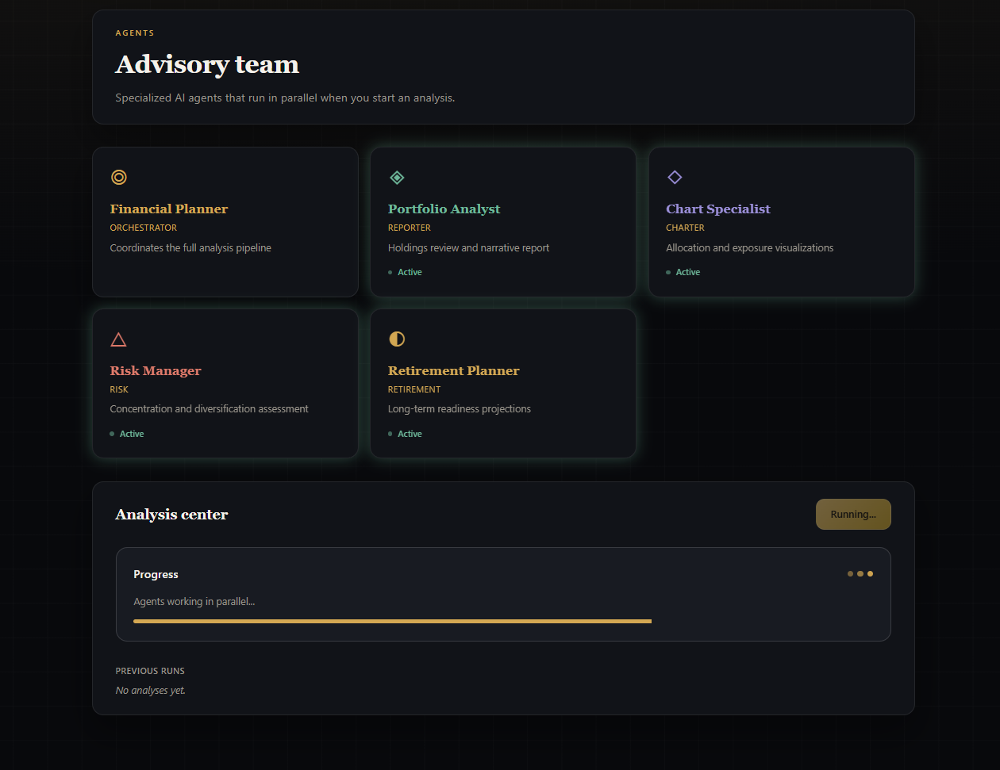
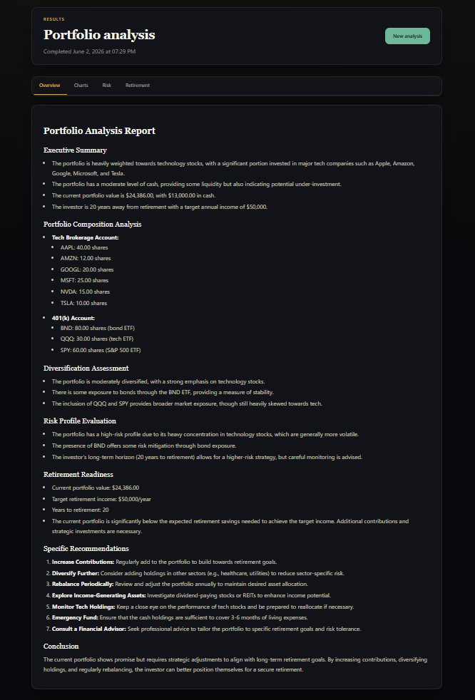
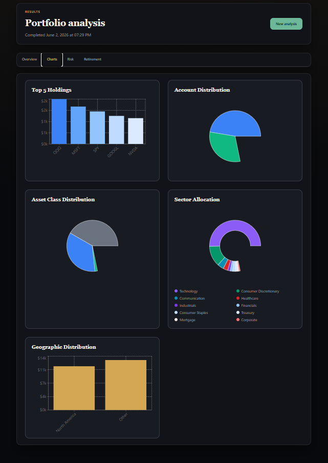
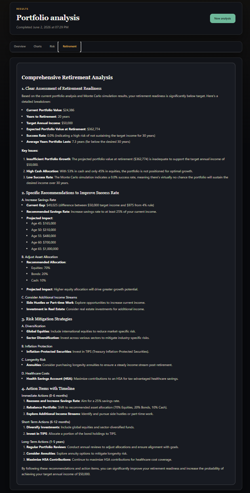
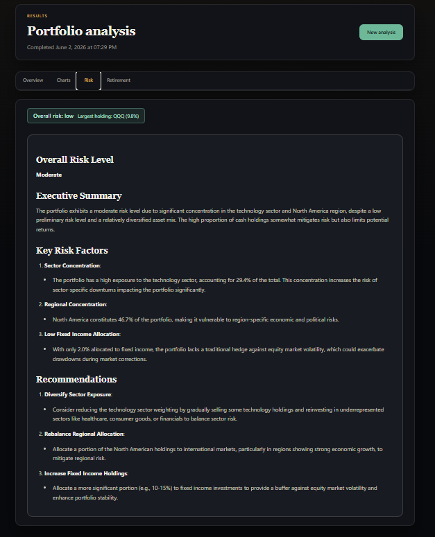

# Alex — AI Portfolio Intelligence

Alex is a full-stack financial portfolio assistant I built on AWS. Users sign in, track accounts and holdings, and run a coordinated multi-agent analysis that produces written reports, charts, retirement projections, and risk assessment.

## Screenshots

<p align="center">
  
</p>
<p align="center">
  
</p>
<p align="center">
  
</p>
<p align="center">
  
</p>
<p align="center">
  
</p>

> **Note:** AWS infrastructure is not required to browse the code. A full live demo needs Aurora, SQS, and the agent Lambdas (see `terraform/`). Screenshots above are from a completed analysis run.

## What it does

- **Portfolio dashboard** — accounts, positions, allocation views
- **Multi-agent analysis** — one click triggers an orchestrated pipeline of specialized AI agents
- **Structured outputs** — markdown report, chart data, retirement model, risk review (stored per job)
- **Market research pipeline** — optional web research agent that ingests findings into a vector knowledge base for richer reports
- **Instrument tagging** — automatic classification of tickers (asset class, region, sector) when data is missing

## Agent team

The advisory-team page shows the five analysis agents below; **Instrument Tagger** runs automatically in the pipeline when holdings need classification, and **Researcher** is an optional side path.

| Agent | Role |
|-------|------|
| **Financial Planner** | Triggered by SQS; orchestrates the workflow by invoking the other agent Lambdas |
| **Instrument Tagger** | Classifies holdings with structured LLM output (pipeline step, not shown on the advisory-team UI) |
| **Portfolio Analyst (Reporter)** | Writes the narrative portfolio report; enriches it with SEC 10-K context (`backend/sec_rag`) and web research from S3 Vectors |
| **Chart Specialist (Charter)** | JSON chart payloads for the UI |
| **Risk Manager** | Concentration and diversification assessment |
| **Retirement Planner** | Monte Carlo style readiness projections |
| **Researcher** | Optional — browses financial sites and stores research in S3 Vectors (separate from the main analysis flow) |

## Architecture

```text
Browser (Next.js + Clerk)
        │
        ▼
API (FastAPI locally; same app as alex-api Lambda + API Gateway in production)
        │
        ▼
Aurora Serverless (users, accounts, positions, jobs)
        │
        ▼
SQS ──► Planner Lambda ──► Tagger / Reporter / Charter / Retirement / Risk

Researcher ──► Ingest API ──► SageMaker embeddings ──► S3 Vectors
Reporter ──► SEC RAG (10-K filings) + S3 Vectors (web research)
```

**AWS services used:** Lambda, SQS, Aurora Serverless v2 (Data API), API Gateway, S3 / S3 Vectors, SageMaker Serverless, Bedrock, Secrets Manager, CloudFront (production frontend).

**Stack:** Python 3.12 (`uv`), OpenAI Agents SDK, LiteLLM + Bedrock, Next.js, TypeScript, Terraform.

## Project structure

```text
portfolio-advisor/
├── backend/          # Agents, ingest, API, sec_rag, database library
├── frontend/         # Next.js app
├── terraform/        # IaC per layer (see terraform/README.md)
├── scripts/          # Local dev and deploy helpers
└── assets/           # README screenshots
```

## Local development

**Prerequisites:** Node.js, Python 3.12, [uv](https://docs.astral.sh/uv/), AWS CLI configured, Clerk app, deployed AWS resources.

1. Copy the root environment template and create frontend Clerk config:

   ```bash
   cp .env.example .env
   ```

   Create `frontend/.env.local` with your [Clerk](https://clerk.com) keys (from the Clerk dashboard):

   ```env
   NEXT_PUBLIC_CLERK_PUBLISHABLE_KEY=pk_test_...
   CLERK_SECRET_KEY=sk_test_...
   NEXT_PUBLIC_CLERK_AFTER_SIGN_IN_URL=/dashboard
   NEXT_PUBLIC_CLERK_AFTER_SIGN_UP_URL=/dashboard
   ```

2. Run database migrations (after Aurora is up):

   ```bash
   cd backend/database
   uv run run_migrations.py
   ```

3. Start both servers (recommended):

   ```bash
   cd scripts && uv run run_local.py
   ```

   This starts the FastAPI backend and Next.js frontend together. To run them separately instead: `cd backend/api && uv run main.py` and `cd frontend && npm install && npm run dev`.

   - App: http://localhost:3000  
   - API: http://localhost:8000  

Do not commit `.env`, `terraform.tfvars`, or `*.tfstate` — they contain secrets and account-specific IDs.

## Deployment

Infrastructure is split into independent Terraform directories under `terraform/` (SageMaker → ingestion → optional researcher → database → agents → frontend). Deploy in that order; each folder has its own state. See `terraform/README.md`.

## Disclaimer

Alex is for educational and demonstration purposes. It is not financial, tax, or investment advice.
